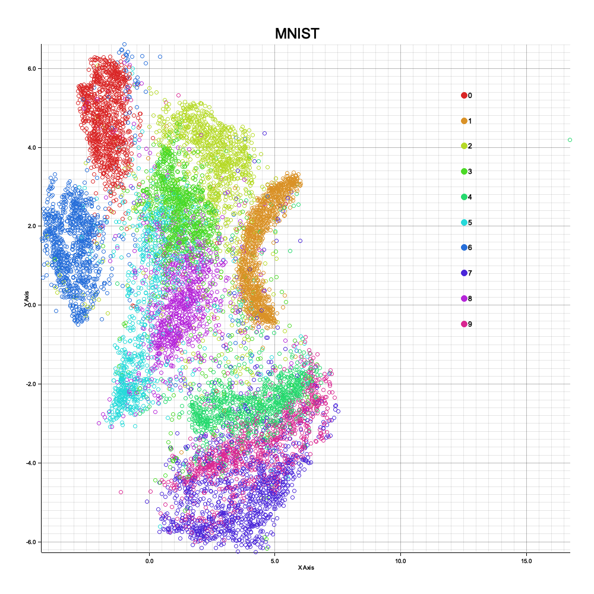
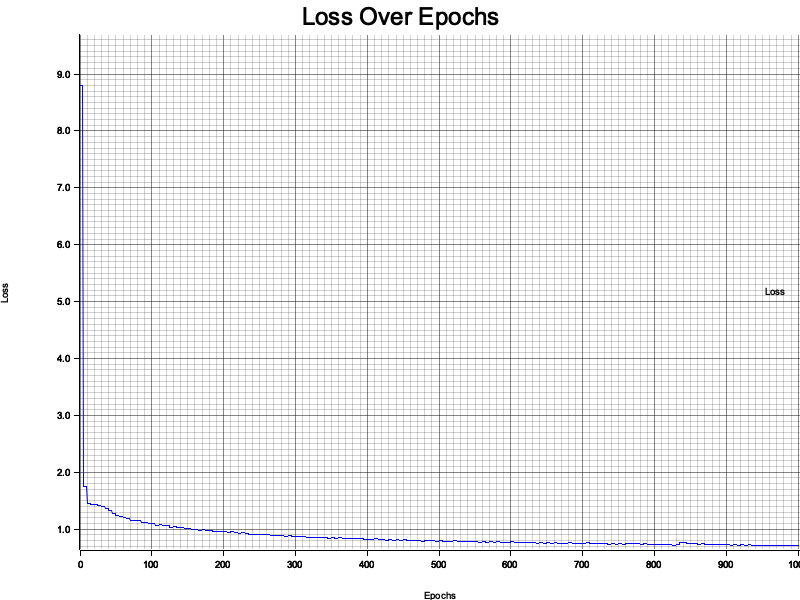
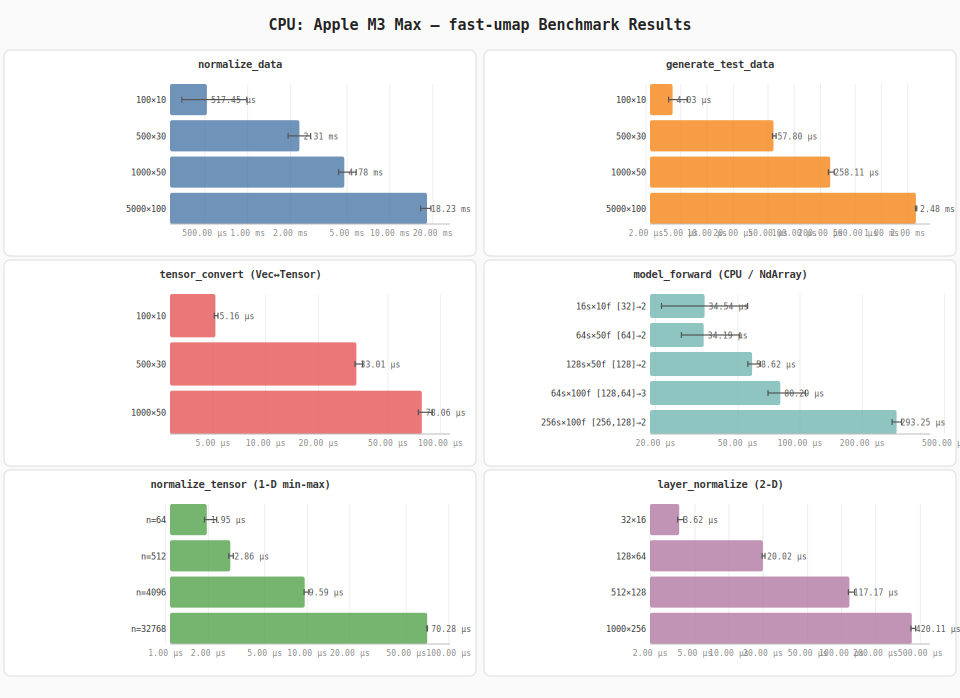
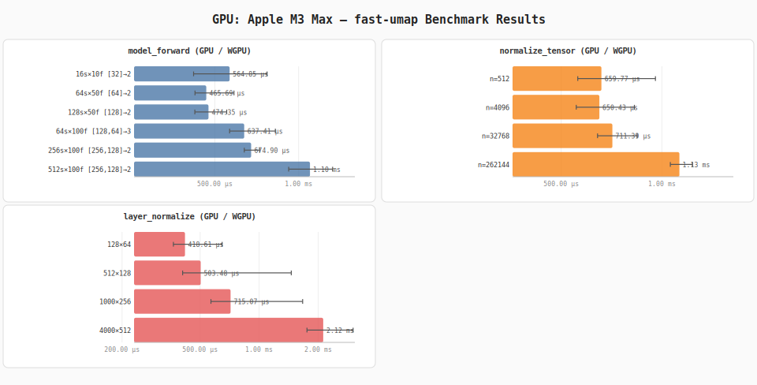
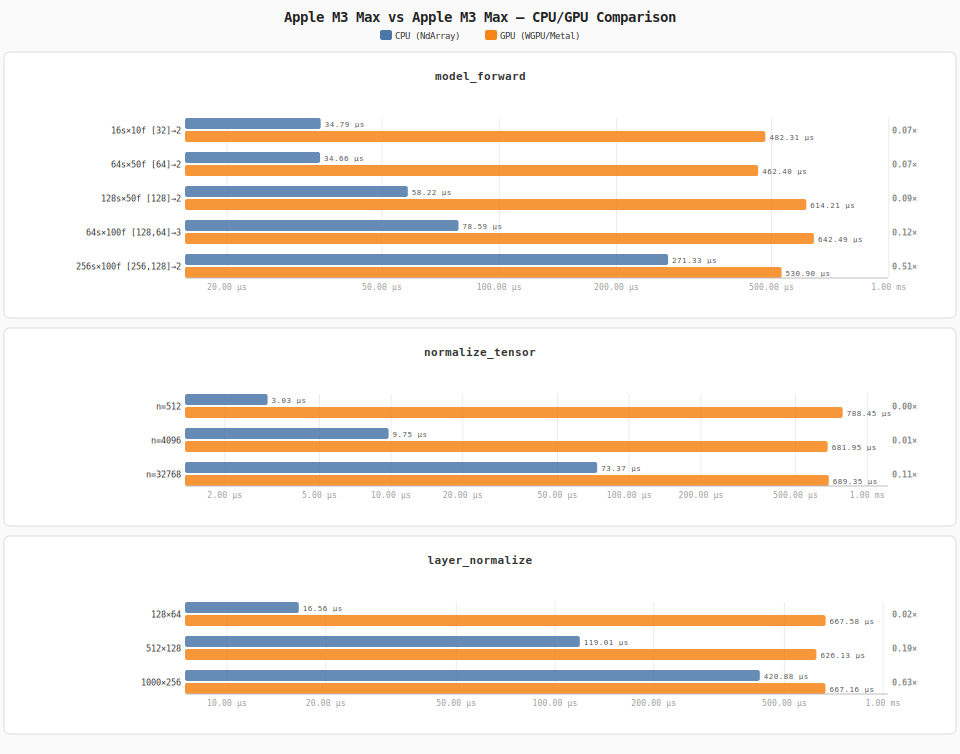

# fast-umap

GPU-accelerated parametric UMAP (Uniform Manifold Approximation and Projection)
in Rust, built on [burn](https://github.com/tracel-ai/burn) +
[CubeCL](https://github.com/tracel-ai/cubecl).

See [docs.rs](https://docs.rs/crate/fast-umap/latest) for the full API reference.

---

## Highlights

- **Up to 9.2× faster** than [umap-rs](https://crates.io/crates/umap-rs) on
  datasets ≥ 5 000 samples (see [benchmarks](#performance--fast-umap-vs-umap-rs) below)
- **Parametric** — trains a neural network, so you can
  [`transform()`](#transform-new-data) new unseen data instantly
- **GPU-accelerated** — custom CubeCL kernels for pairwise distance and KNN,
  compiled for Metal / Vulkan / DX12 via WGPU
- **API mirrors umap-rs** — drop-in replacement with `Umap::new(config).fit(data)`
- **Automatic differentiation** — full autograd through custom GPU kernels
- **CPU fallback** — runs on NdArray backend (no GPU required for inference or tests)

---

## Performance — fast-umap vs umap-rs

Benchmarked on Apple M3 Max. Both crates receive identical random data.
fast-umap runs 50 epochs (parametric, GPU); umap-rs runs 200 epochs
(classical SGD, CPU). Total time includes data prep + KNN + fit + extract.


| Dataset | fast-umap | umap-rs | Speedup |
|---------|-----------|---------|---------|
| 500 × 50 | 0.22s | 0.06s | 0.29× *(umap-rs faster)* |
| 1 000 × 50 | 0.81s | 0.12s | 0.15× *(umap-rs faster)* |
| 2 000 × 100 | 0.92s | 0.44s | 0.48× *(umap-rs faster)* |
| **5 000 × 100** | **1.62s** | **2.27s** | **1.4× faster** 🚀 |
| **10 000 × 100** | **2.06s** | **8.67s** | **4.2× faster** 🚀 |
| **20 000 × 100** | **3.72s** | **34.22s** | **9.2× faster** 🚀 |

> **Crossover ≈ 5 000 samples.** Below that, umap-rs wins on raw CPU
> efficiency for small data. Above it, fast-umap pulls ahead and the gap
> widens with dataset size — umap-rs's brute-force KNN scales O(n²) while
> fast-umap's per-epoch cost is capped.

**Why fast-umap wins at scale:**

| Technique | Effect |
|-----------|--------|
| Sparse edge-based loss | O(n·k) per epoch instead of O(n²) |
| Edge subsampling | Caps edges/epoch at 50K regardless of n |
| Pre-batched negative samples on GPU | Zero per-epoch CPU→GPU transfers |
| Fused index gather | 2 GPU `select()` calls instead of 4 |
| Async loss readback | GPU→CPU sync every 5 epochs, not every epoch |
| In-memory checkpointing | No disk I/O during training |
| GPU-accelerated KNN | Full n×n pairwise distance on GPU (one-time cost) |

**Reproduce:**

```shell
./bench.sh --only comparison
```

Or run all benchmarks at once (hardware + comparison + MNIST):

```shell
./bench.sh
```

---

## What's New (v1.1.0)

See [CHANGELOG.md](CHANGELOG.md) for the full release history.

| Area | Change |
|------|--------|
| **New API** | `Umap::new(config).fit(data)` returns `FittedUmap` with `.embedding()`, `.transform()`, `.into_embedding()` — mirrors umap-rs |
| **Sparse training** | O(n·k) per epoch with edge subsampling + negative sampling (was O(n²)) |
| **burn upgrade** | `0.18` → `0.20.1`; cubecl `0.6` → `0.9` |
| **API fixes** | `Backend::seed` now takes `(&device, seed)`; `as_tensor_arg` no longer takes a generic type param; `NodeID` renamed `NodeId` |
| **Kernel fixes** | `ABSOLUTE_POS_X/Y` cast to `usize` for shape indexing; all `for i in 0..k` loops use `k as usize` |
| **GPU fix** | `normalize_tensor` used `.to_vec::<bool>()` which panics on WGPU (booleans stored as `u32`); replaced with f32 arithmetic comparison |
| **Warning fixes** | All 4 `unused Result` warnings from kernel launches resolved with `.expect()` |
| **Tests** | 36 unit tests added (`cargo test`), all CPU-only via NdArray backend |
| **Benchmarks** | `cargo run --release --bin bench_report` — auto-detects CPU & GPU, writes hardware-tagged `.md` + `.svg` + CPU vs GPU comparison |
| **Crate comparison** | `cargo run --release --example crate_comparison` — fast-umap vs umap-rs benchmark |

---

## Features

- **Dimensionality Reduction** — projects high-dimensional data to 2-D or 3-D for visualization
- **Parametric model** — learned neural network can project new, unseen data via `transform()`
- **GPU-accelerated kernels** — custom CubeCL kernels for Euclidean pairwise distance and KNN, compiled for WGPU (Metal / Vulkan / DX12)
- **Automatic differentiation** — full autograd through the custom kernels via burn's autodiff backend
- **Sparse training** — edge subsampling + negative sampling keeps per-epoch cost constant regardless of dataset size
- **Flexible architecture** — configurable hidden layers, output dims, distance metric, learning rate, early stopping, timeout
- **CPU fallback** — all model code runs on NdArray (no GPU required for inference or tests)
- **36 unit tests** — covering normalization, tensor conversion, model shape, distance math
- **Hardware-tagged benchmarks** — CPU and GPU timings saved as Markdown + SVG, including a CPU vs GPU comparison chart

---

## Installation

```shell
cargo add fast-umap
```

`Cargo.toml`:

```toml
[dependencies]
fast-umap  = "1.1.0"
burn       = { version = "0.20.1", features = ["wgpu", "autodiff", "autotune"] }
cubecl     = { version = "0.9.0",  features = ["wgpu"] }
```

---

## Quick Start

```rust
use cubecl::wgpu::WgpuRuntime;
use fast_umap::prelude::*;

type MyBackend = burn::backend::wgpu::CubeBackend<WgpuRuntime, f32, i32, u32>;
type MyAutodiffBackend = burn::backend::Autodiff<MyBackend>;

// 100 samples × 10 features
let data: Vec<Vec<f64>> = generate_test_data(100, 10)
    .chunks(10)
    .map(|c| c.iter().map(|&x: &f32| x as f64).collect())
    .collect();

// Fit UMAP (default: 2-D output, Euclidean distance)
let config = UmapConfig::default();
let umap = fast_umap::Umap::<MyAutodiffBackend>::new(config);
let fitted = umap.fit(data.clone(), None);

// Get embedding
let embedding = fitted.embedding();
println!("Shape: {} × {}", embedding.len(), embedding[0].len());
```

---

## API Overview

The public API mirrors [`umap-rs`](https://crates.io/crates/umap-rs):

| Type | Description |
|------|-------------|
| [`Umap<B>`](https://docs.rs/fast-umap/latest/fast_umap/struct.Umap.html) | Main algorithm struct — `Umap::new(config)` |
| [`FittedUmap<B>`](https://docs.rs/fast-umap/latest/fast_umap/struct.FittedUmap.html) | Fitted model — `.embedding()`, `.transform()`, `.into_embedding()`, `.config()` |
| [`UmapConfig`](https://docs.rs/fast-umap/latest/fast_umap/struct.UmapConfig.html) | Configuration with nested `GraphParams` + `OptimizationParams` |
| [`GraphParams`](https://docs.rs/fast-umap/latest/fast_umap/struct.GraphParams.html) | `n_neighbors`, `metric`, `normalized`, `minkowski_p` |
| [`OptimizationParams`](https://docs.rs/fast-umap/latest/fast_umap/struct.OptimizationParams.html) | `n_epochs`, `learning_rate`, `patience`, `timeout`, `verbose`, … |
| [`Metric`](https://docs.rs/fast-umap/latest/fast_umap/enum.Metric.html) | `Euclidean`, `EuclideanKNN`, `Manhattan`, `Cosine` |

### Configuration

```rust
let config = UmapConfig {
    n_components: 2,
    hidden_sizes: vec![128],
    graph: GraphParams {
        n_neighbors: 15,
        metric: Metric::Euclidean,
        ..Default::default()
    },
    optimization: OptimizationParams {
        n_epochs: 200,
        learning_rate: 1e-3,
        patience: Some(50),
        verbose: true,
        ..Default::default()
    },
    ..Default::default()
};
```

### Key parameters

| Parameter | Default | Description |
|-----------|---------|-------------|
| `n_components` | 2 | Output dimensionality (2-D or 3-D) |
| `hidden_sizes` | `[100, 100, 100]` | Neural network hidden layer sizes |
| `n_neighbors` | 15 | KNN graph neighbours |
| `n_epochs` | 200 | Training epochs |
| `learning_rate` | 1e-3 | Adam step size |
| `batch_size` | 1 000 | Samples per batch |
| `penalty` | 0.0 | L2 weight decay |
| `metric` | `Euclidean` | Distance metric |
| `repulsion_strength` | 1.0 | Repulsion term weight |
| `patience` | `None` | Early-stop epochs without improvement |
| `min_desired_loss` | `None` | Stop when loss ≤ threshold |
| `timeout` | `None` | Hard time limit (seconds) |
| `verbose` | `true` | Progress bar + loss plots |

### Transform new data

Because fast-umap is *parametric* (neural network), it can project new
unseen data — something classical UMAP cannot do:

```rust
let fitted = umap.fit(training_data, None);

// Project new data through the trained model
let new_embedding = fitted.transform(new_data);
```

---

## Examples

### Simple — random data, 2-D embedding

```shell
cargo run --release --example simple
```

```rust
use cubecl::wgpu::WgpuRuntime;
use fast_umap::prelude::*;

fn main() {
    type MyBackend = burn::backend::wgpu::CubeBackend<WgpuRuntime, f32, i32, u32>;
    type MyAutodiffBackend = burn::backend::Autodiff<MyBackend>;

    let data: Vec<Vec<f64>> = (0..100 * 3)
        .map(|_| rand::rng().random::<f64>())
        .collect::<Vec<_>>()
        .chunks_exact(3)
        .map(|c| c.to_vec())
        .collect();

    let config = UmapConfig::default();
    let umap = fast_umap::Umap::<MyAutodiffBackend>::new(config);
    let fitted = umap.fit(data.clone(), None);

    let embedding = fitted.embedding();
    println!("Embedding shape: {} × {}", embedding.len(), embedding[0].len());

    // Transform new unseen data through the trained model
    let _new_embedding = fitted.transform(data);
}
```

### Advanced — 1 000 samples, custom config

```shell
cargo run --release --example advanced
```

```rust
use cubecl::wgpu::WgpuRuntime;
use fast_umap::prelude::*;

fn main() {
    type MyBackend = burn::backend::wgpu::CubeBackend<WgpuRuntime, f32, i32, u32>;
    type MyAutodiffBackend = burn::backend::Autodiff<MyBackend>;

    let train_data: Vec<f32> = generate_test_data(1000, 100);
    let data: Vec<Vec<f32>> = train_data.chunks(100).map(|c| c.to_vec()).collect();

    let config = UmapConfig {
        n_components: 2,
        hidden_sizes: vec![100, 100, 100],
        graph: GraphParams {
            n_neighbors: 10,
            metric: Metric::Euclidean,
            ..Default::default()
        },
        optimization: OptimizationParams {
            n_epochs: 100,
            batch_size: 1000,
            learning_rate: 0.001,
            verbose: true,
            min_desired_loss: Some(0.001),
            timeout: Some(60),
            ..Default::default()
        },
        ..Default::default()
    };

    let umap = fast_umap::Umap::<MyAutodiffBackend>::new(config);
    let fitted = umap.fit(data, None);

    println!("Embedding: {} samples × {} dims",
        fitted.embedding().len(), fitted.embedding()[0].len());
}
```

### MNIST — 10 000 hand-written digits projected to 2-D

```shell
cargo run --release --example mnist         # quick run (no figures)
./bench.sh --only mnist                     # generate figures
```

Downloads the MNIST dataset on first run (~12 MB), trains UMAP on 10K
digits (784 features → 2-D).

| 2-D digit embedding (coloured by class) | Loss curve |
|:----------------------------------------:|:----------:|
|  |  |

```rust
let config = UmapConfig {
    n_components: 2,
    hidden_sizes: vec![256],
    graph: GraphParams {
        n_neighbors: 15,
        metric: Metric::Euclidean,
        ..Default::default()
    },
    optimization: OptimizationParams {
        n_epochs: 1_000,
        learning_rate: 1e-3,
        patience: Some(100),
        repulsion_strength: 3.0,
        penalty: 1e-6,
        verbose: true,
        ..Default::default()
    },
    ..Default::default()
};

let umap = fast_umap::Umap::<MyAutodiffBackend>::new(config);
let fitted = umap.fit(data, Some(labels));
```

---

## Generating Figures

All figures are generated by the benchmark suite, not by the examples.
Examples are lightweight smoke tests that verify correctness without
writing any files.

```shell
# Run all benchmarks and generate all figures
./bench.sh

# Run only specific benchmarks
./bench.sh --only comparison          # fast-umap vs umap-rs chart
./bench.sh --only mnist               # MNIST embedding + loss curve
./bench.sh --only hardware            # CPU + GPU micro-benchmarks
./bench.sh --only mnist comparison    # combine multiple

# Skip MNIST (saves ~70s)
./bench.sh --skip-mnist

# Include Criterion statistical suite
./bench.sh --criterion
```

### What generates what

| Benchmark | Output |
|-----------|--------|
| `comparison` | `figures/crate_comparison.{svg,json,md}` |
| `mnist` | `figures/mnist.png`, `figures/losses_model.png` |
| `hardware` | `benches/results/{cpu,gpu,comparison}_*.{svg,md}` |
| `criterion` | `target/criterion/` (HTML reports) |

### Run examples (no figures)

```shell
./run_all.sh                  # all examples
./run_all.sh --skip-mnist     # skip MNIST download
```

---

## Architecture

fast-umap uses a **parametric** approach — a small feed-forward neural network
is trained with the UMAP cross-entropy loss:

```text
attraction  =  mean_{k-NN edges}      [ −log q_ij ]
repulsion   =  mean_{negative samples} [ −log (1 − q_ij) ]
loss        =  attraction  +  repulsion_strength × repulsion
```

where `q_ij = 1 / (1 + d_ij²)` is the Student-t kernel applied to embedding
distances.

### Training pipeline

```
Input data [n, features]
    │
    ▼
GPU pairwise distance → KNN graph (one-time O(n²) cost)
    │
    ▼
┌─── Per epoch (cost: O(min(n·k, 50K))) ───┐
│  Forward pass: data → neural net → [n, 2] │
│  Edge subsampling from KNN graph           │
│  Negative sampling (random non-neighbors)  │
│  UMAP cross-entropy loss                   │
│  Backward pass + Adam optimizer step       │
└────────────────────────────────────────────┘
    │
    ▼
FittedUmap with .embedding() and .transform()
```

### Modules

| Module | Description |
|--------|-------------|
| [`model`] | `UMAPModel` neural network and config builder |
| [`train`] | Training loop, `UmapConfig`, sparse training, loss computation |
| [`chart`] | 2-D scatter plots and loss curves (plotters) |
| [`utils`] | Data generation, tensor conversion, normalisation |
| [`kernels`] | Custom CubeCL GPU kernels (Euclidean distance, k-NN) |
| [`backend`] | Backend trait extension for custom kernel dispatch |
| [`distances`] | CPU-side distance functions (Euclidean, cosine, Minkowski…) |
| [`prelude`] | Re-exports of the most commonly used items |

---

## Legacy API

The original `UMAP` struct and `train()` function are still available for
backward compatibility:

```rust
use fast_umap::prelude::*;

// Legacy one-liner
let umap: fast_umap::UMAP<MyAutodiffBackend> = umap(data.clone());
let embedding = umap.transform(data);

// Legacy manual training
let (model, losses, best_loss) = fast_umap::train::train(
    "my_run", model, num_samples, num_features,
    train_data, &config, device, exit_rx, None,
);
```

> **Note:** The legacy API uses the dense O(n²) training path. Use the new
> `Umap::new(config).fit(data)` API for the optimized sparse training path.

---

## Testing

All tests run on CPU (`burn::backend::NdArray`) — no GPU required.

```shell
cargo test
```

| Category | What is covered |
|----------|----------------|
| `normalize_data` | correctness, zero-mean/unit-std, constant columns |
| `format_duration` | zero, seconds, minutes, hours |
| `generate_test_data` | shape, bounds `[0, 1)` |
| `tensor_convert` | round-trip `Vec → Tensor → Vec`, NaN → 0 |
| `normalize_tensor` | output in `[0, 1]`, constant-input safety |
| `layer_normalize` | no NaN, shape preserved |
| `UMAPModelConfigBuilder` | defaults and custom values |
| `TrainingConfig` | builder, `Metric::from(&str)`, invalid-metric panic |
| `UMAPModel` | 2-D / 3-D output, deep network, determinism, no NaN |
| Distance math | Euclidean self=0, 3-4-5 triangle, symmetry; Manhattan |

---

## Micro-benchmarks

**Reproduce:** `./bench.sh --only hardware`

Full detail files:
[cpu\_apple\_m3\_max.md](benches/results/cpu_apple_m3_max.md) ·
[gpu\_apple\_m3\_max.md](benches/results/gpu_apple_m3_max.md) ·
[comparison\_apple\_m3\_max.md](benches/results/comparison_apple_m3_max.md) ·
[cpu\_apple\_silicon\_aarch64.md](benches/results/cpu_apple_silicon_aarch64.md)

### CPU — Apple M3 Max (NdArray backend)



| Benchmark | Input | Min | **Mean** | Max |
|-----------|-------|-----|----------|-----|
| `normalize_data` | 100×10 | 294 µs | **439 µs** | 675 µs |
| `normalize_data` | 500×30 | 1.90 ms | **2.41 ms** | 2.97 ms |
| `normalize_data` | 1 000×50 | 4.26 ms | **4.80 ms** | 5.56 ms |
| `normalize_data` | 5 000×100 | 16.3 ms | **17.2 ms** | 18.6 ms |
| `generate_test_data` | 100×10 | 3.62 µs | **4.12 µs** | 14.0 µs |
| `generate_test_data` | 500×30 | 57.6 µs | **61.7 µs** | 88.7 µs |
| `generate_test_data` | 1 000×50 | 191 µs | **199 µs** | 247 µs |
| `generate_test_data` | 5 000×100 | 1.91 ms | **1.99 ms** | 2.16 ms |
| `tensor_convert` | 100×10 | 5.08 µs | **5.21 µs** | 8.04 µs |
| `tensor_convert` | 500×30 | 30.7 µs | **33.2 µs** | 42.1 µs |
| `tensor_convert` | 1 000×50 | 71.5 µs | **76.7 µs** | 92.3 µs |
| `model_forward` | 16s×10f \[32\]→2 | 20.5 µs | **34.8 µs** | 52.1 µs |
| `model_forward` | 64s×50f \[64\]→2 | 27.1 µs | **34.7 µs** | 49.8 µs |
| `model_forward` | 128s×50f \[128\]→2 | 54.3 µs | **58.2 µs** | 71.2 µs |
| `model_forward` | 64s×100f \[128,64\]→3 | 72.6 µs | **78.6 µs** | 135 µs |
| `model_forward` | 256s×100f \[256,128\]→2 | 246 µs | **271 µs** | 368 µs |
| `normalize_tensor` | n=64 | 1.88 µs | **1.93 µs** | 2.00 µs |
| `normalize_tensor` | n=512 | 2.75 µs | **3.03 µs** | 3.88 µs |
| `normalize_tensor` | n=4 096 | 9.46 µs | **9.75 µs** | 12.4 µs |
| `normalize_tensor` | n=32 768 | 69.9 µs | **73.4 µs** | 91.5 µs |
| `layer_normalize` | 32×16 | 3.50 µs | **3.60 µs** | 3.88 µs |
| `layer_normalize` | 128×64 | 16.3 µs | **16.6 µs** | 17.4 µs |
| `layer_normalize` | 512×128 | 116 µs | **119 µs** | 129 µs |
| `layer_normalize` | 1 000×256 | 412 µs | **421 µs** | 446 µs |

### GPU — Apple M3 Max (WGPU / Metal)



| Benchmark | Input | Min | **Mean** | Max |
|-----------|-------|-----|----------|-----|
| `model_forward` | 16s×10f \[32\]→2 | 370 µs | **482 µs** | 1.19 ms |
| `model_forward` | 64s×50f \[64\]→2 | 349 µs | **462 µs** | 747 µs |
| `model_forward` | 128s×50f \[128\]→2 | 423 µs | **614 µs** | 846 µs |
| `model_forward` | 64s×100f \[128,64\]→3 | 505 µs | **642 µs** | 998 µs |
| `model_forward` | 256s×100f \[256,128\]→2 | 461 µs | **531 µs** | 1.00 ms |
| `model_forward` | 512s×100f \[256,128\]→2 | 871 µs | **1.05 ms** | 1.36 ms |
| `normalize_tensor` | n=512 | 554 µs | **788 µs** | 1.36 ms |
| `normalize_tensor` | n=4 096 | 606 µs | **682 µs** | 853 µs |
| `normalize_tensor` | n=32 768 | 635 µs | **689 µs** | 779 µs |
| `normalize_tensor` | n=262 144 | 1.07 ms | **1.13 ms** | 1.31 ms |
| `layer_normalize` | 128×64 | 463 µs | **668 µs** | 798 µs |
| `layer_normalize` | 512×128 | 486 µs | **626 µs** | 832 µs |
| `layer_normalize` | 1 000×256 | 618 µs | **667 µs** | 714 µs |
| `layer_normalize` | 4 000×512 | 1.55 ms | **1.66 ms** | 1.79 ms |

### CPU vs GPU — Apple M3 Max



| Benchmark | Input | CPU | GPU | Speedup |
|-----------|-------|-----|-----|---------|
| `model_forward` | 16s×10f \[32\]→2 | **34.8 µs** | 482 µs | 0.07× *(CPU faster)* |
| `model_forward` | 64s×50f \[64\]→2 | **34.7 µs** | 462 µs | 0.07× *(CPU faster)* |
| `model_forward` | 128s×50f \[128\]→2 | **58.2 µs** | 614 µs | 0.09× *(CPU faster)* |
| `model_forward` | 64s×100f \[128,64\]→3 | **78.6 µs** | 642 µs | 0.12× *(CPU faster)* |
| `model_forward` | 256s×100f \[256,128\]→2 | **271 µs** | 531 µs | 0.51× *(CPU faster)* |
| `normalize_tensor` | n=512 | **3.03 µs** | 788 µs | 0.00× *(CPU faster)* |
| `normalize_tensor` | n=4 096 | **9.75 µs** | 682 µs | 0.01× *(CPU faster)* |
| `normalize_tensor` | n=32 768 | **73.4 µs** | 689 µs | 0.11× *(CPU faster)* |
| `layer_normalize` | 128×64 | **16.6 µs** | 668 µs | 0.02× *(CPU faster)* |
| `layer_normalize` | 512×128 | **119 µs** | 626 µs | 0.19× *(CPU faster)* |
| `layer_normalize` | 1 000×256 | **421 µs** | 667 µs | 0.63× *(CPU faster)* |

> **Note:** WGPU/Metal has a fixed dispatch overhead of ~400–700 µs per kernel
> call. For the small model sizes above, that overhead dominates. The GPU wins
> in full UMAP training loops over thousands of samples where operations are
> chained without intermediate CPU readbacks.

### Running benchmarks

```shell
# All benchmarks (hardware + comparison + MNIST)
./bench.sh

# + Criterion statistics (~5 min)
./bench.sh --criterion

# Just hardware micro-benchmarks
./bench.sh --only hardware
```

---

## Roadmap

- [x] MNIST dataset example with intermediate plots
- [x] Charting behind a feature flag
- [x] Labels in plots
- [x] Batching + accumulated gradient
- [x] CubeCL kernels for distance computation
- [x] Hyperparameter testbench (`patience` vs `n_features` vs `epochs` …)
- [x] Unit tests (36) and hardware benchmarks
- [x] New API mirroring umap-rs (`Umap`, `FittedUmap`, `UmapConfig`)
- [x] Sparse training with edge subsampling + negative sampling
- [x] Crate comparison benchmark (fast-umap vs umap-rs)
- [ ] PCA warm-start for initial embedding
- [ ] Approximate KNN (NN-descent) for datasets > 50K

---

## License

MIT — see [LICENSE](LICENSE).

## Copyright

2024-2026, Eugene Hauptmann

## Citations

If you use fast-umap in research or a project, please cite the original UMAP
paper, this repository, and acknowledge the Burn and CubeCL frameworks:

### fast-umap

```bibtex
@software{hauptmann2024fastumap,
  title   = {fast-umap: GPU-Accelerated UMAP in Rust},
  author  = {Hauptmann, Eugene},
  year    = {2024},
  url     = {https://github.com/eugenehp/fast-umap},
  version = {1.1.0}
}
```

> Hauptmann, E. (2024). *fast-umap: GPU-Accelerated UMAP in Rust* (v1.0.0).
> <https://github.com/eugenehp/fast-umap>

### UMAP algorithm

```bibtex
@article{mcinnes2018umap,
  title   = {{UMAP}: Uniform Manifold Approximation and Projection for Dimension Reduction},
  author  = {McInnes, Leland and Healy, John and Melville, James},
  journal = {arXiv preprint arXiv:1802.03426},
  year    = {2018},
  url     = {https://arxiv.org/abs/1802.03426}
}
```

> McInnes, L., Healy, J., & Melville, J. (2018).
> *UMAP: Uniform Manifold Approximation and Projection for Dimension Reduction.*
> arXiv:1802.03426. <https://arxiv.org/abs/1802.03426>

### Burn deep-learning framework

```bibtex
@software{burn2024,
  title   = {Burn: A Flexible and Comprehensive Deep Learning Framework in Rust},
  author  = {{Tracel AI}},
  year    = {2024},
  url     = {https://github.com/tracel-ai/burn}
}
```

### CubeCL GPU compute framework

```bibtex
@software{cubecl2024,
  title  = {CubeCL: Multi-platform GPU Compute Language for Rust},
  author = {{Tracel AI}},
  year   = {2024},
  url    = {https://github.com/tracel-ai/cubecl}
}
```

---

## Thank you

Inspired by the original UMAP [paper](https://arxiv.org/abs/1802.03426).
