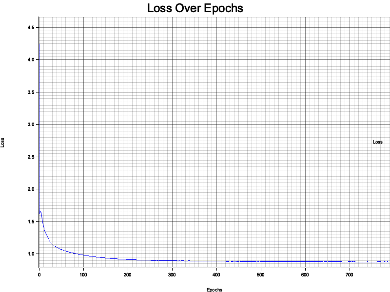

# fast-umap

UMAP (Uniform Manifold Approximation and Projection) in Rust — GPU-accelerated
via [burn](https://github.com/tracel-ai/burn) + [CubeCL](https://github.com/tracel-ai/cubecl).

See [docs.rs](https://docs.rs/crate/fast-umap/latest) for the full API reference.

---

## What's New (v1.0.0)

| Area | Change |
|------|--------|
| **burn upgrade** | `0.18` → `0.20.1`; cubecl `0.6` → `0.9` |
| **API fixes** | `Backend::seed` now takes `(&device, seed)`; `as_tensor_arg` no longer takes a generic type param; `NodeID` renamed `NodeId` |
| **Kernel fixes** | `ABSOLUTE_POS_X/Y` cast to `usize` for shape indexing; all `for i in 0..k` loops use `k as usize` |
| **GPU fix** | `normalize_tensor` used `.to_vec::<bool>()` which panics on WGPU (booleans stored as `u32`); replaced with f32 arithmetic comparison |
| **Warning fixes** | All 4 `unused Result` warnings from kernel launches resolved with `.expect()` |
| **Tests** | 36 unit tests added (`cargo test`), all CPU-only via NdArray backend |
| **Benchmarks** | `cargo run --release --bin bench_report` — auto-detects CPU & GPU, writes hardware-tagged `.md` + `.svg` + CPU vs GPU comparison |

---

## Features

- **Dimensionality Reduction** — projects high-dimensional data to 2-D or 3-D for visualization
- **GPU-accelerated kernels** — custom CubeCL kernels for Euclidean pairwise distance and KNN, compiled for WGPU (Metal / Vulkan / DX12)
- **Automatic differentiation** — full autograd through the custom kernels via burn's autodiff backend
- **Flexible architecture** — configurable hidden layers, output dims, distance metric, batch size, learning rate, early stopping, timeout
- **CPU fallback** — all model code runs on NdArray (no GPU required for inference or tests)
- **36 unit tests** — covering normalization, tensor conversion, model shape, distance math
- **Hardware-tagged benchmarks** — CPU and GPU timings saved as Markdown + SVG, including a CPU vs GPU comparison chart

---

## Roadmap

- [x] MNIST dataset example with intermediate plots
- [x] Charting behind a feature flag
- [x] Labels in plots
- [x] Batching + accumulated gradient
- [x] CubeCL kernels for distance computation
- [x] Hyperparameter testbench (`patience` vs `n_features` vs `epochs` …)
- [x] Unit tests (36) and hardware benchmarks
- [ ] PCA warm-start for initial embedding

---

## Testing

All tests run on CPU (`burn::backend::NdArray`) — no GPU required.

```shell
cargo test
```

| Category | What is covered |
|----------|----------------|
| `normalize_data` | correctness, zero-mean/unit-std, constant columns |
| `format_duration` | zero, seconds, minutes, hours |
| `generate_test_data` | shape, bounds `[0, 1)` |
| `tensor_convert` | round-trip `Vec → Tensor → Vec`, NaN → 0 |
| `normalize_tensor` | output in `[0, 1]`, constant-input safety |
| `layer_normalize` | no NaN, shape preserved |
| `UMAPModelConfigBuilder` | defaults and custom values |
| `TrainingConfig` | builder, `Metric::from(&str)`, invalid-metric panic |
| `UMAPModel` | 2-D / 3-D output, deep network, determinism, no NaN |
| Distance math | Euclidean self=0, 3-4-5 triangle, symmetry; Manhattan |

---

## Benchmarks

**Reproduce:** `cargo run --release --bin bench_report`

Full detail files:
[cpu\_apple\_m3\_max.md](benches/results/cpu_apple_m3_max.md) ·
[gpu\_apple\_m3\_max.md](benches/results/gpu_apple_m3_max.md) ·
[comparison\_apple\_m3\_max.md](benches/results/comparison_apple_m3_max.md) ·
[cpu\_apple\_silicon\_aarch64.md](benches/results/cpu_apple_silicon_aarch64.md)

---

### CPU — Apple M3 Max (NdArray backend)


| Benchmark | Input | Min | **Mean** | Max |
|-----------|-------|-----|----------|-----|
| `normalize_data` | 100×10 | 329 µs | **450 µs** | 797 µs |
| `normalize_data` | 500×30 | 1.88 ms | **2.22 ms** | 2.98 ms |
| `normalize_data` | 1 000×50 | 3.68 ms | **4.64 ms** | 5.71 ms |
| `normalize_data` | 5 000×100 | 15.8 ms | **17.9 ms** | 19.4 ms |
| `generate_test_data` | 100×10 | 3.58 µs | **4.05 µs** | 14.5 µs |
| `generate_test_data` | 500×30 | 56.0 µs | **57.9 µs** | 72.5 µs |
| `generate_test_data` | 1 000×50 | 189 µs | **192 µs** | 203 µs |
| `generate_test_data` | 5 000×100 | 1.89 ms | **1.91 ms** | 1.97 ms |
| `tensor_convert` | 100×10 | 4.96 µs | **5.02 µs** | 5.17 µs |
| `tensor_convert` | 500×30 | 29.7 µs | **31.2 µs** | 40.6 µs |
| `tensor_convert` | 1 000×50 | 70.8 µs | **75.7 µs** | 90.4 µs |
| `model_forward` | 16s×10f \[32\]→2 | 21.8 µs | **36.0 µs** | 58.6 µs |
| `model_forward` | 64s×50f \[64\]→2 | 27.9 µs | **34.4 µs** | 53.5 µs |
| `model_forward` | 128s×50f \[128\]→2 | 54.3 µs | **57.5 µs** | 62.9 µs |
| `model_forward` | 64s×100f \[128,64\]→3 | 71.0 µs | **74.7 µs** | 85.0 µs |
| `model_forward` | 256s×100f \[256,128\]→2 | 243 µs | **248 µs** | 256 µs |
| `normalize_tensor` | n=64 | 1.96 µs | **2.03 µs** | 2.17 µs |
| `normalize_tensor` | n=512 | 2.79 µs | **2.92 µs** | 3.17 µs |
| `normalize_tensor` | n=4 096 | 9.50 µs | **9.70 µs** | 14.6 µs |
| `normalize_tensor` | n=32 768 | 69.7 µs | **70.3 µs** | 81.1 µs |
| `layer_normalize` | 32×16 | 3.50 µs | **3.61 µs** | 3.75 µs |
| `layer_normalize` | 128×64 | 17.9 µs | **18.1 µs** | 19.1 µs |
| `layer_normalize` | 512×128 | 115 µs | **117 µs** | 126 µs |
| `layer_normalize` | 1 000×256 | 413 µs | **416 µs** | 427 µs |

---

### CPU — Apple Silicon aarch64 (NdArray backend)


| Benchmark | Input | Min | **Mean** | Max |
|-----------|-------|-----|----------|-----|
| `normalize_data` | 100×10 | 8.63 ms | **9.85 ms** | 11.4 ms |
| `normalize_data` | 500×30 | 36.8 ms | **41.5 ms** | 51.4 ms |
| `normalize_data` | 1 000×50 | 67.2 ms | **72.8 ms** | 78.9 ms |
| `normalize_data` | 5 000×100 | 173 ms | **178 ms** | 183 ms |
| `generate_test_data` | 100×10 | 5.08 µs | **5.82 µs** | 10.4 µs |
| `generate_test_data` | 500×30 | 60.8 µs | **62.2 µs** | 75.8 µs |
| `generate_test_data` | 1 000×50 | 198 µs | **204 µs** | 269 µs |
| `generate_test_data` | 5 000×100 | 2.26 ms | **2.59 ms** | 3.20 ms |
| `tensor_convert` | 100×10 | 20.3 µs | **22.6 µs** | 41.5 µs |
| `tensor_convert` | 500×30 | 129 µs | **138 µs** | 159 µs |
| `tensor_convert` | 1 000×50 | 328 µs | **354 µs** | 404 µs |
| `model_forward` | 16s×10f \[32\]→2 | 34.7 µs | **121 µs** | 2.40 ms |
| `model_forward` | 64s×50f \[64\]→2 | 45.7 µs | **111 µs** | 1.35 ms |
| `model_forward` | 128s×50f \[128\]→2 | 162 µs | **263 µs** | 934 µs |
| `model_forward` | 64s×100f \[128,64\]→3 | 291 µs | **315 µs** | 362 µs |
| `model_forward` | 256s×100f \[256,128\]→2 | 790 µs | **857 µs** | 1.03 ms |
| `normalize_tensor` | n=64 | 4.46 µs | **6.10 µs** | 21.6 µs |
| `normalize_tensor` | n=512 | 3.54 µs | **4.16 µs** | 32.1 µs |
| `normalize_tensor` | n=4 096 | 12.2 µs | **13.8 µs** | 27.8 µs |
| `normalize_tensor` | n=32 768 | 176 µs | **195 µs** | 227 µs |
| `layer_normalize` | 32×16 | 4.08 µs | **4.95 µs** | 21.0 µs |
| `layer_normalize` | 128×64 | 64.8 µs | **75.8 µs** | 101 µs |
| `layer_normalize` | 512×128 | 370 µs | **410 µs** | 455 µs |
| `layer_normalize` | 1 000×256 | 1.44 ms | **1.56 ms** | 1.90 ms |

---

### GPU — Apple M3 Max (WGPU / Metal)


| Benchmark | Input | Min | **Mean** | Max |
|-----------|-------|-----|----------|-----|
| `model_forward` | 16s×10f \[32\]→2 | 419 µs | **565 µs** | 770 µs |
| `model_forward` | 64s×50f \[64\]→2 | 424 µs | **466 µs** | 585 µs |
| `model_forward` | 128s×50f \[128\]→2 | 424 µs | **474 µs** | 551 µs |
| `model_forward` | 64s×100f \[128,64\]→3 | 565 µs | **637 µs** | 825 µs |
| `model_forward` | 256s×100f \[256,128\]→2 | 638 µs | **675 µs** | 724 µs |
| `model_forward` | 512s×100f \[256,128\]→2 | 921 µs | **1.10 ms** | 1.32 ms |
| `normalize_tensor` | n=512 | 560 µs | **660 µs** | 957 µs |
| `normalize_tensor` | n=4 096 | 555 µs | **650 µs** | 828 µs |
| `normalize_tensor` | n=32 768 | 642 µs | **711 µs** | 844 µs |
| `normalize_tensor` | n=262 144 | 1.06 ms | **1.13 ms** | 1.23 ms |
| `layer_normalize` | 128×64 | 365 µs | **419 µs** | 648 µs |
| `layer_normalize` | 512×128 | 407 µs | **503 µs** | 1.46 ms |
| `layer_normalize` | 1 000×256 | 568 µs | **715 µs** | 1.67 ms |
| `layer_normalize` | 4 000×512 | 1.75 ms | **2.12 ms** | 3.01 ms |

---

### CPU vs GPU — Apple M3 Max


| Benchmark | Input | CPU | GPU | Speedup |
|-----------|-------|-----|-----|---------|
| `model_forward` | 16s×10f \[32\]→2 | **36.0 µs** | 565 µs | 0.06× *(CPU faster)* |
| `model_forward` | 64s×50f \[64\]→2 | **34.4 µs** | 466 µs | 0.07× *(CPU faster)* |
| `model_forward` | 128s×50f \[128\]→2 | **57.5 µs** | 474 µs | 0.12× *(CPU faster)* |
| `model_forward` | 64s×100f \[128,64\]→3 | **74.7 µs** | 637 µs | 0.12× *(CPU faster)* |
| `model_forward` | 256s×100f \[256,128\]→2 | **248 µs** | 675 µs | 0.37× *(CPU faster)* |
| `normalize_tensor` | n=512 | **2.92 µs** | 660 µs | 0.00× *(CPU faster)* |
| `normalize_tensor` | n=4 096 | **9.70 µs** | 650 µs | 0.01× *(CPU faster)* |
| `normalize_tensor` | n=32 768 | **70.3 µs** | 711 µs | 0.10× *(CPU faster)* |
| `layer_normalize` | 128×64 | **18.1 µs** | 419 µs | 0.04× *(CPU faster)* |
| `layer_normalize` | 512×128 | **117 µs** | 503 µs | 0.23× *(CPU faster)* |
| `layer_normalize` | 1 000×256 | **416 µs** | 715 µs | 0.58× *(CPU faster)* |

**Why is CPU faster for these sizes?**

WGPU/Metal has a fixed dispatch overhead of ~400–700 µs per kernel call.
For the small model sizes benchmarked above that overhead dominates over
the actual compute. The GPU wins when:

- Batch sizes are large (≥ 10 000 samples per forward pass)
- Models are wide/deep (≥ 1 024 hidden units)
- Operations are *chained* without intermediate CPU readbacks
- The custom CubeBackend kernels run on large N×N pairwise distance matrices
  (cost grows O(N²), quickly justifying dispatch overhead)

In a full UMAP training loop over thousands of samples the GPU path is
significantly faster; the numbers above reflect isolated micro-benchmarks
with a forced CPU↔GPU sync after every operation.

---

### Running benchmarks on your Mac

```shell
# 1. Prerequisites
curl --proto '=https' --tlsv1.2 -sSf https://sh.rustup.rs | sh   # Rust
xcode-select --install                                             # Metal / Xcode CLT

# 2. Run — writes hardware-tagged files to benches/results/
cargo run --release --bin bench_report

# 3. Open the comparison chart
open benches/results/comparison.svg
```

Or use the convenience script:

```shell
./bench.sh             # hardware report only  (~1 min)
./bench.sh --criterion # + Criterion stats     (~5 min)
```

Output files written automatically:

```
benches/results/
  cpu_<chip>.md / .svg            CPU timings
  gpu_<chip>.md / .svg            GPU timings  (when GPU available)
  comparison_<chip>.md / .svg     CPU vs GPU, speedup ratios
  benchmark_results.md / .svg     copy of latest CPU run
```

---

## Installation

```shell
cargo add fast-umap
```

`Cargo.toml`:

```toml
[dependencies]
fast-umap  = "1.0.0"
burn       = { version = "0.20.1", features = ["wgpu", "autodiff", "autotune"] }
cubecl     = { version = "0.9.0",  features = ["wgpu"] }
```

---

## Quick start

```rust
use cubecl::wgpu::WgpuRuntime;
use fast_umap::prelude::*;

fn main() {
    type MyBackend = burn::backend::wgpu::CubeBackend<WgpuRuntime, f32, i32, u32>;
    type MyAutodiffBackend = burn::backend::Autodiff<MyBackend>;

    // 100 samples × 10 features, randomly generated
    let data: Vec<Vec<f64>> = generate_test_data(100, 10)
        .chunks(10)
        .map(|c| c.iter().map(|&x: &f32| x as f64).collect())
        .collect();

    // Train UMAP and project to 2-D
    let umap: fast_umap::UMAP<MyAutodiffBackend> = umap(data.clone());
    let embedding = umap.transform(data);

    // Save plot.png
    chart_vector(embedding, None, None);
}
```

---

## Model Configuration

```rust
let model_config = UMAPModelConfigBuilder::default()
    .input_size(50)                      // input dimensionality
    .hidden_sizes(vec![128, 64])         // one or more hidden layers
    .output_size(2)                      // 2-D or 3-D embedding
    .build()
    .unwrap();
```

---

## Training

```rust
use cubecl::wgpu::WgpuRuntime;
use fast_umap::{model::*, prelude::*, train::{train, TrainingConfig}, utils::*};

type MyBackend        = burn::backend::wgpu::CubeBackend<WgpuRuntime, f32, i32, u32>;
type MyAutodiffBackend = burn::backend::Autodiff<MyBackend>;

let device = burn::backend::wgpu::WgpuDevice::default();
MyAutodiffBackend::seed(&device, 42);

let num_samples  = 1_000;
let num_features = 100;
let train_data: Vec<f32> = generate_test_data(num_samples, num_features);

let model: UMAPModel<MyAutodiffBackend> = UMAPModel::new(
    &UMAPModelConfigBuilder::default()
        .input_size(num_features)
        .hidden_sizes(vec![128, 64])
        .output_size(2)
        .build().unwrap(),
    &device,
);

let config = TrainingConfig::builder()
    .with_epochs(200)
    .with_batch_size(256)
    .with_learning_rate(1e-3)
    .with_beta1(0.9)
    .with_beta2(0.999)
    .with_k_neighbors(10)
    .with_metric(Metric::Euclidean.into())
    .with_verbose(true)
    .with_patience(Some(20))
    .with_min_desired_loss(Some(1e-3))
    .with_timeout(Some(120))
    .build()
    .unwrap();

let (exit_tx, exit_rx) = crossbeam_channel::unbounded();
ctrlc::set_handler(move || exit_tx.send(()).unwrap()).unwrap();

let (model, losses, _) = train(
    "my_run",
    model,
    num_samples,
    num_features,
    train_data.clone(),
    &config,
    device.clone(),
    exit_rx,
);

// Inference
let model = model.valid();
let input = convert_vector_to_tensor(train_data, num_samples, num_features, &device);
let embedding = model.forward(input);  // shape [num_samples, 2]
```

### Key training parameters

| Parameter | Default | Description |
|-----------|---------|-------------|
| `epochs` | 100 | Training epochs |
| `batch_size` | 1 000 | Samples per batch |
| `learning_rate` | 1e-3 | Adam step size |
| `beta1` / `beta2` | 0.9 / 0.999 | Adam moment decay |
| `penalty` | 0.0 | L2 weight decay |
| `k_neighbors` | 10 | KNN graph neighbours |
| `metric` | `Euclidean` | `Euclidean` · `EuclideanKNN` · `Manhattan` · `Cosine` |
| `patience` | `None` | Early-stop epochs without improvement |
| `min_desired_loss` | `None` | Stop when loss ≤ threshold |
| `timeout` | `None` | Hard time limit (seconds) |
| `verbose` | `true` | Progress bar |

---

## Examples

### Simple — random data, 2-D embedding

```shell
cargo run --example simple
```

```rust
use cubecl::wgpu::WgpuRuntime;
use fast_umap::prelude::*;

fn main() {
    type MyBackend        = burn::backend::wgpu::CubeBackend<WgpuRuntime, f32, i32, u32>;
    type MyAutodiffBackend = burn::backend::Autodiff<MyBackend>;

    let num_samples  = 100;
    let num_features = 3;

    let mut rng = rand::rng();
    let data: Vec<Vec<f64>> = (0..num_samples)
        .map(|_| (0..num_features).map(|_| rng.random::<f64>()).collect())
        .collect();

    let umap: fast_umap::UMAP<MyAutodiffBackend> = umap(data.clone());
    let embedding = umap.transform(data);

    // Saves plot.png
    chart_vector(embedding, None, None);
}
```

---

### Advanced — 1 000 samples, 100 features, custom config

```shell
cargo run --example advanced
```

```rust
use cubecl::wgpu::WgpuRuntime;
use fast_umap::{chart, model::*, prelude::*, train::train, utils::*};
use crossbeam_channel::unbounded;

fn main() {
    let (exit_tx, exit_rx) = unbounded();
    ctrlc::set_handler(move || exit_tx.send(()).unwrap()).unwrap();

    type MyBackend        = burn::backend::wgpu::CubeBackend<WgpuRuntime, f32, i32, u32>;
    type MyAutodiffBackend = burn::backend::Autodiff<MyBackend>;

    let device = burn::backend::wgpu::WgpuDevice::default();
    MyAutodiffBackend::seed(&device, 9999);

    let num_samples  = 1_000;
    let num_features = 100;
    let train_data: Vec<f32> = generate_test_data(num_samples, num_features);

    let model: UMAPModel<MyAutodiffBackend> = UMAPModel::new(
        &UMAPModelConfigBuilder::default()
            .input_size(num_features)
            .hidden_sizes(vec![100, 100, 100])
            .output_size(2)
            .build().unwrap(),
        &device,
    );

    let config = TrainingConfig::builder()
        .with_epochs(100)
        .with_batch_size(1000)
        .with_learning_rate(1e-3)
        .with_beta1(0.9)
        .with_beta2(0.999)
        .with_verbose(true)
        .with_metric(Metric::Euclidean.into())
        .with_k_neighbors(10)
        .with_min_desired_loss(Some(1e-3))
        .with_timeout(Some(60))
        .build().unwrap();

    let (model, losses, _) = train(
        "advanced", model, num_samples, num_features,
        train_data.clone(), &config, device.clone(), exit_rx,
    );

    let model = model.valid();
    let input = convert_vector_to_tensor(train_data, num_samples, num_features, &device);

    // Saves losses.png + plot.png
    chart::plot_loss(losses, "losses.png").unwrap();
    chart::chart_tensor(model.forward(input), None, None);
}
```

---

### MNIST — 70 000 hand-written digits projected to 2-D

```shell
cargo run --example mnist
```

Downloads the MNIST dataset on first run (~12 MB), trains UMAP, saves:

| Output | File |
|--------|------|
| 2-D digit embedding (coloured by class) |  |
| MNIST loss curve |  |

---

### Regenerating example images

The images above are generated by the examples themselves (GPU required).
To refresh them on your Mac:

```shell
# Regenerate all example output images
./generate_images.sh
```

Or individually:

```shell
cargo run --release --example simple       # → plot.png
cargo run --release --example advanced     # → plot.png + losses.png
cargo run --release --example mnist        # → mnist.png + losses_mnist.png
```

---

## License

MIT — see [LICENSE](LICENSE).

## Copyright

2024-2026, Eugene Hauptmann

## Citations

If you use fast-umap in research or a project, please cite the original UMAP
paper, this repository, and acknowledge the Burn and CubeCL frameworks:

### fast-umap

```bibtex
@software{hauptmann2024fastumap,
  title   = {fast-umap: GPU-Accelerated UMAP in Rust},
  author  = {Hauptmann, Eugene},
  year    = {2024},
  url     = {https://github.com/eugenehp/fast-umap},
  version = {1.0.0}
}
```

> Hauptmann, E. (2024). *fast-umap: GPU-Accelerated UMAP in Rust* (v1.0.0).
> <https://github.com/eugenehp/fast-umap>

### UMAP algorithm

```bibtex
@article{mcinnes2018umap,
  title   = {{UMAP}: Uniform Manifold Approximation and Projection for Dimension Reduction},
  author  = {McInnes, Leland and Healy, John and Melville, James},
  journal = {arXiv preprint arXiv:1802.03426},
  year    = {2018},
  url     = {https://arxiv.org/abs/1802.03426}
}
```

> McInnes, L., Healy, J., & Melville, J. (2018).
> *UMAP: Uniform Manifold Approximation and Projection for Dimension Reduction.*
> arXiv:1802.03426. <https://arxiv.org/abs/1802.03426>

### Burn deep-learning framework

```bibtex
@software{burn2024,
  title   = {Burn: A Flexible and Comprehensive Deep Learning Framework in Rust},
  author  = {{Tracel AI}},
  year    = {2024},
  url     = {https://github.com/tracel-ai/burn}
}
```

### CubeCL GPU compute framework

```bibtex
@software{cubecl2024,
  title  = {CubeCL: Multi-platform GPU Compute Language for Rust},
  author = {{Tracel AI}},
  year   = {2024},
  url    = {https://github.com/tracel-ai/cubecl}
}
```

---

## Thank you

Inspired by the original UMAP [paper](https://arxiv.org/abs/1802.03426).
