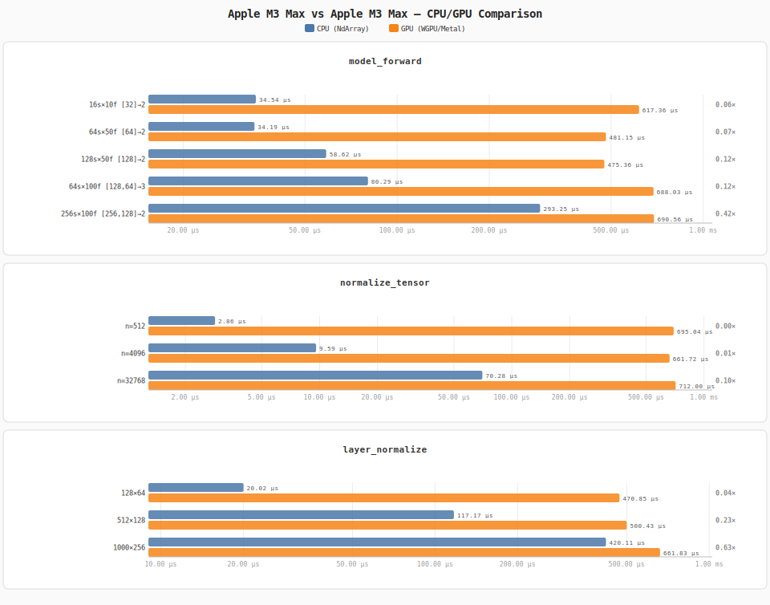

# fast-umap — CPU vs GPU Comparison

> **CPU:** Apple M3 Max  
> **GPU:** Apple M3 Max (WGPU / Metal)  
> **Backend:** burn 0.20.1 · NdArray vs WGPU  
> **Reproduce:** `cargo run --release --bin bench_report`

Speedup = CPU mean ÷ GPU mean.  
> 1× = GPU faster, < 1× = CPU faster (e.g. small tensors where dispatch overhead dominates).

---

## `model_forward`

| Input | model_forward (CPU / NdArray) | model_forward (GPU / WGPU) | Speedup |
|-------|-------------------------------|----------------------------|----------|
| `16s×10f [32]→2` | 34.79 µs | 482.31 µs | 0.07× *(CPU faster)* |
| `64s×50f [64]→2` | 34.66 µs | 462.40 µs | 0.07× *(CPU faster)* |
| `128s×50f [128]→2` | 58.22 µs | 614.21 µs | 0.09× *(CPU faster)* |
| `64s×100f [128,64]→3` | 78.59 µs | 642.49 µs | 0.12× *(CPU faster)* |
| `256s×100f [256,128]→2` | 271.33 µs | 530.90 µs | 0.51× *(CPU faster)* |

## `normalize_tensor`

| Input | normalize_tensor (1-D min-max) | normalize_tensor (GPU / WGPU) | Speedup |
|-------|--------------------------------|-------------------------------|----------|
| `n=512` | 3.03 µs | 788.45 µs | 0.00× *(CPU faster)* |
| `n=4096` | 9.75 µs | 681.95 µs | 0.01× *(CPU faster)* |
| `n=32768` | 73.37 µs | 689.35 µs | 0.11× *(CPU faster)* |

## `layer_normalize`

| Input | layer_normalize (2-D) | layer_normalize (GPU / WGPU) | Speedup |
|-------|-----------------------|------------------------------|----------|
| `128×64` | 16.56 µs | 667.58 µs | 0.02× *(CPU faster)* |
| `512×128` | 119.01 µs | 626.13 µs | 0.19× *(CPU faster)* |
| `1000×256` | 420.88 µs | 667.16 µs | 0.63× *(CPU faster)* |

