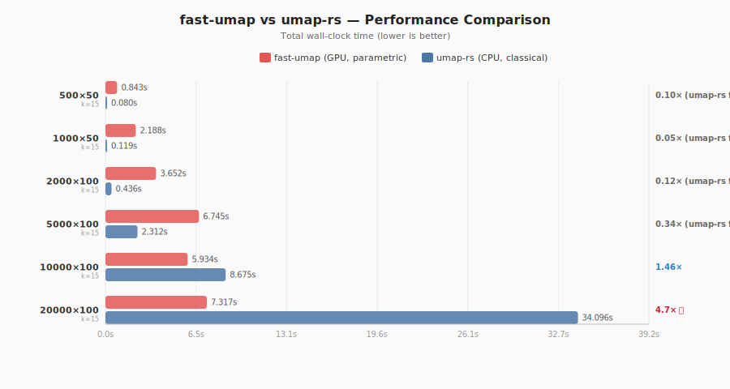

# fast-umap vs umap-rs — Crate Comparison

> **Date:** 2026-02-24 18:44 UTC  
> **fast-umap:** 50 epochs (parametric, GPU)  
> **umap-rs:** 200 epochs (classical, CPU)  
> **Reproduce:** `cargo run --release --example crate_comparison`

## Total Time (data prep + fit + extract)

| Dataset | fast-umap | umap-rs | Speedup |
|---------|-----------|---------|--------|
| 500×50 | 0.843s | 0.080s | 0.10×  |
| 1000×50 | 2.188s | 0.119s | 0.05×  |
| 2000×100 | 3.652s | 0.436s | 0.12×  |
| 5000×100 | 6.745s | 2.312s | 0.34×  |
| 10000×100 | 5.934s | 8.675s | 1.46× 🚀 |
| 20000×100 | 7.317s | 34.096s | 4.66× 🚀 |

## Fit Time Only

| Dataset | fast-umap | umap-rs | Speedup |
|---------|-----------|---------|--------|
| 500×50 | 0.843s | 0.069s | 0.08×  |
| 1000×50 | 2.188s | 0.074s | 0.03×  |
| 2000×100 | 3.651s | 0.113s | 0.03×  |
| 5000×100 | 6.743s | 0.248s | 0.04×  |
| 10000×100 | 5.930s | 0.387s | 0.07×  |
| 20000×100 | 7.307s | 0.731s | 0.10×  |

---

**Notes:**
- fast-umap is a *parametric* UMAP (neural network, GPU-accelerated via burn/CubeCL)
- umap-rs is a *classical* UMAP (SGD on embedding, CPU, multithreaded via rayon)
- fast-umap includes batch-local KNN computation; umap-rs requires precomputed KNN (included in total time)
- fast-umap can `transform()` new unseen data; umap-rs cannot (yet)
