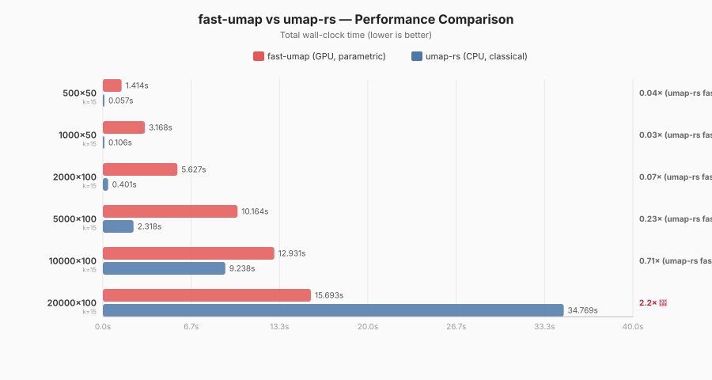

# fast-umap vs umap-rs — Crate Comparison

> **Date:** 2026-04-24 02:43 UTC  
> **fast-umap:** 50 epochs (parametric, GPU)  
> **umap-rs:** 200 epochs (classical, CPU)  
> **Reproduce:** `cargo run --release --example crate_comparison`

## Total Time (data prep + fit + extract)

| Dataset | fast-umap | umap-rs | Speedup |
|---------|-----------|---------|--------|
| 500×50 | 1.414s | 0.057s | 0.04×  |
| 1000×50 | 3.168s | 0.106s | 0.03×  |
| 2000×100 | 5.627s | 0.401s | 0.07×  |
| 5000×100 | 10.164s | 2.318s | 0.23×  |
| 10000×100 | 12.931s | 9.238s | 0.71×  |
| 20000×100 | 15.693s | 34.769s | 2.22× 🚀 |

## Fit Time Only

| Dataset | fast-umap | umap-rs | Speedup |
|---------|-----------|---------|--------|
| 500×50 | 1.414s | 0.045s | 0.03×  |
| 1000×50 | 3.168s | 0.063s | 0.02×  |
| 2000×100 | 5.626s | 0.101s | 0.02×  |
| 5000×100 | 10.161s | 0.236s | 0.02×  |
| 10000×100 | 12.924s | 0.460s | 0.04×  |
| 20000×100 | 15.670s | 1.025s | 0.07×  |

---

**Notes:**
- fast-umap is a *parametric* UMAP (neural network, GPU-accelerated via burn/CubeCL)
- umap-rs is a *classical* UMAP (SGD on embedding, CPU, multithreaded via rayon)
- fast-umap includes batch-local KNN computation; umap-rs requires precomputed KNN (included in total time)
- fast-umap can `transform()` new unseen data; umap-rs cannot (yet)
